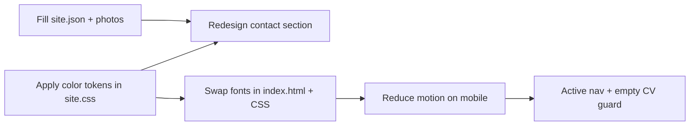
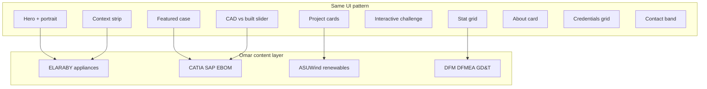

# UX recommendations — Omar portfolio

A designer review of the current site (React clone of [moustafasharaf.com](https://moustafasharaf.com/)) with suggested colors, fonts, and UX improvements. **Nothing here is implemented yet** — use this as a decision doc before changing CSS or `site.json`.

---

## 1. Diagnosis

### What already works

| Strength | Why it matters |
|----------|----------------|
| **Evidence-first narrative** | “Proof before promises,” count-up stats, and featured case study read like an engineer’s dossier, not a generic portfolio. |
| **Project depth** | Case-study dialogs (challenge → work → outcome) match how hiring managers and clients actually evaluate hardware work. |
| **Interactive proof** | The engineering challenge and CAD-vs-built slider are memorable differentiators — keep them. |
| **JSON content model** | Omar can update copy without touching React — good for long-term maintenance. |
| **Dark-only** | Fits lab / workshop / CAD context; avoids the “white SaaS landing page” trap. |

### What feels weak today

| Issue | Impact |
|-------|--------|
| **Clone visibility** | Same section order, copy patterns, and MARS-Z placeholder facts make Omar read as “template” until photos and bio are his. See **§8** for a LinkedIn-backed section map tailored to Omar Abu Qahf. |
| **Accent overload** | Mint (`#7bf7be`), lilac (`#b79cff`), and acid lilac (`#d6c7ff`) compete on hero, portrait ring, progress bar, kickers, and contact band in one scroll. |
| **Neon mint fatigue** | Large mint surfaces (contact section, primary buttons) feel trendy; engineering portfolios benefit from *calm confidence*. |
| **Instrument Serif at hero scale** | At ~5–8rem, editorial serif can look fashion/editorial rather than precision/mechanical — especially with animated shine. |
| **Empty contact state** | With no email, WhatsApp, LinkedIn, or CV in `site.json`, the contact band is a big mint block with no actions — worst possible first impression. |
| **Placeholder imagery** | Labeled SVG placeholders are honest for dev, but on a public URL they undermine “50+ builds” credibility. |
| **Motion density** | Cursor glow + grain + orbit rings + headline shine + card tilt + marquee on first screen is a lot; mobile users get the worst of it. |

**Bottom line:** The *structure* is strong. The *visual system* needs restraint, and the *content* needs Omar’s voice before launch — including section narratives aligned to his profile (§8), not Moustafa’s MARS-Z story.

---

## 2. Recommended color system

Stay on **dark + green + purple**, but separate roles so only one accent leads per section.

### Design principles

1. **Mint = action** (primary CTA, selection, key metric emphasis).
2. **Violet = wayfinding** (kickers, progress, orbit ring, secondary labels) — not full-width backgrounds.
3. **Neutrals carry the page** — most of the UI should be ink, muted, and hairline borders.
4. **Contact band** should not reuse hero mint as a full bleed until contrast and content are fixed.

### Proposed tokens (drop-in `:root`)

Replace or extend variables in [`src/styles/site.css`](src/styles/site.css):

| Token | Current | Recommended | Role |
|-------|---------|-------------|------|
| `--bg` | `#07110f` | `#0a1210` | Page canvas — slightly lifted, still deep |
| `--bg-soft` | `#0b1815` | `#0f1a17` | Nested surfaces |
| `--panel` | `#10201c` | `#141f1c` | Cards, header glass |
| `--panel-2` | `#142822` | `#1a2a24` | Hover / nested panels |
| `--ink` | `#eaf7f2` | `#e8f0ec` | Primary text |
| `--muted` | `#94aaa2` | `#8fa39a` | Body secondary |
| `--line` | `rgba(222,247,238,0.14)` | `rgba(200,220,210,0.12)` | Hairlines |
| `--line-strong` | `rgba(222,247,238,0.28)` | `rgba(200,220,210,0.22)` | Focus borders |
| `--green` (primary) | `#7bf7be` | `#6dd4a8` | CTAs, primary accent — less neon |
| `--green-bright` | — | `#8ae8c4` | Hover only, sparingly |
| `--acid` (highlight) | `#d6c7ff` | `#c4b5fd` | Badges, portrait chip — softer lilac |
| `--blue` (secondary) | `#b79cff` | `#9b8ec4` | Kickers, progress secondary — dusty violet |
| `--violet-soft` | — | `#7c6aad` | Eyebrow dots, orbit secondary node |
| `--danger` | `#ff796b` | `#e87066` | Challenge “at risk” — slightly muted |
| `--contact-bg` | `var(--green)` | `#122820` | Contact section background |
| `--contact-accent` | — | `#6dd4a8` | Contact CTAs on dark green panel |

### Accent usage map (one lead color per section)

```text
Hero        → violet kicker + mint CTA only (no lilac headline shine)
Proof       → mint numbers, neutral cards
Featured    → neutral media + mint metric chip
Work grid   → neutral cards; mint on hover/index only
Challenge   → mint CTA; violet inside dialog chrome
Compare     → neutral frame; mint handle
About       → acid badge on photo only
Credentials → violet type labels
Contact     → dark green panel + mint buttons (not mint panel)
```

### WCAG notes

| Pairing | Approx. concern | Recommendation |
|---------|-----------------|----------------|
| Mint `#7bf7be` on `#07110f` | Large text OK; small UI labels borderline | Use `#6dd4a8` or bump weight for 12px kickers |
| Mint contact band + dark green text | Current contact uses mint bg + `#24523e` body — acceptable | If keeping mint band, keep body at least `#1a3d2e` and test 4.5:1 |
| Lilac `#b79cff` on dark panel | Fine for kickers at 11px+ uppercase | Don’t use lilac for long paragraphs |
| Mint button text `#06110d` on mint | Good contrast | Keep for primary buttons |

Target **WCAG 2.2 AA** for body copy and **AA for large text** on all kickers and buttons before launch.

### Optional CSS snippet (reference only)

```css
:root {
  --bg: #0a1210;
  --bg-soft: #0f1a17;
  --panel: #141f1c;
  --panel-2: #1a2a24;
  --ink: #e8f0ec;
  --muted: #8fa39a;
  --line: rgba(200, 220, 210, 0.12);
  --line-strong: rgba(200, 220, 210, 0.22);
  --green: #6dd4a8;
  --green-bright: #8ae8c4;
  --acid: #c4b5fd;
  --blue: #9b8ec4;
  --violet-soft: #7c6aad;
  --danger: #e87066;
  --contact-bg: #122820;
  --contact-accent: #6dd4a8;
}
```

Also update hardcoded rgba in [`src/styles/enhance.css`](src/styles/enhance.css) (`--fx-accent-soft`, etc.) to derive from these tokens instead of fixed mint rgba.

---

## 3. Recommended typography

Keep a **three-role stack** (display / body / mono). The current stack is good in theory; execution at hero scale needs tuning.

### Current stack

| Role | Font | Issue |
|------|------|-------|
| Display | Instrument Serif | Beautiful but thin at 6–8rem; shine animation adds “marketing site” |
| Body | DM Sans | Clean, slightly generic SaaS |
| Mono | DM Mono | Fine; pairs weakly with serif display |

### Recommended stack (Option A — refined editorial)

Best if Omar wants personality without losing engineering tone.

| Role | Font | Weights | Use |
|------|------|---------|-----|
| **Display** | **Newsreader** | 400, 500, 600 + italic | H1–H3, project titles — optical size, holds weight at large sizes |
| **Body** | **DM Sans** | 400, 500, 600 | Leads, dialogs, long copy |
| **Mono** | **IBM Plex Mono** | 400, 500 | Kickers, nav, tags, metrics, portrait badge |

```html
<link href="https://fonts.googleapis.com/css2?family=DM+Sans:wght@400;500;600;700&family=IBM+Plex+Mono:wght@400;500&family=Newsreader:ital,opsz,wght@0,6..72,400;0,6..72,500;0,6..72,600;1,6..72,400;1,6..72,500&display=swap" rel="stylesheet" />
```

```css
--font-display: "Newsreader", Georgia, serif;
--font-body: "DM Sans", system-ui, sans-serif;
--font-mono: "IBM Plex Mono", ui-monospace, monospace;
```

**Hero tip:** Use Newsreader **500** for H1, not 400 italic + shine. One strong line beats animated gradient text.

### Recommended stack (Option B — lab notebook)

Best if credibility > editorial flair.

| Role | Font | Weights | Use |
|------|------|---------|-----|
| **Display** | **Fraunces** | 500, 600, 700 | Headlines — quirky but sturdy; soft superellipse feel |
| **Body** | **Source Sans 3** | 400, 500, 600 | Body — neutral, highly readable |
| **Mono** | **JetBrains Mono** | 400, 500 | Technical chrome |

```html
<link href="https://fonts.googleapis.com/css2?family=Fraunces:ital,opsz,wght@0,9..144,500;0,9..144,600;0,9..144,700;1,9..144,500&family=JetBrains+Mono:wght@400;500&family=Source+Sans+3:wght@400;500;600;700&display=swap" rel="stylesheet" />
```

### Recommended stack (Option C — minimal change)

Keep what you have; fix hierarchy in CSS only.

| Change | Detail |
|--------|--------|
| H1 | `font-weight: 500`, remove or reduce headline shine on mobile |
| Kickers | Always `font-mono`, never display serif |
| Project titles | Cap at `clamp(1.5rem, 2.4vw, 2.2rem)` — current max is heavy |
| Body leads | `font-size: 1.05–1.15rem`, `line-height: 1.6` |

### Type scale suggestion

| Element | Size (desktop) | Weight | Font |
|---------|----------------|--------|------|
| H1 | `clamp(2.8rem, 5.5vw, 5.5rem)` | 500–600 | Display |
| H2 | `clamp(2.2rem, 4vw, 4rem)` | 500 | Display |
| H3 | `1.5–2rem` | 500 | Display |
| Lead | `1.05–1.2rem` | 400 | Body |
| Body | `0.9–1rem` | 400 | Body |
| Kicker | `0.72rem` | 500 | Mono, uppercase |
| Metric | `2.5–4rem` | 500 | Display or mono — pick one |

---

## 4. UX enhancements (prioritized)

### P0 — Before sharing the URL publicly

1. **Fill `site.json` profile fields** — email, LinkedIn, CV path, optional WhatsApp/phone. Empty contact is worse than no contact section.
2. **Replace placeholder images** — at minimum: hero portrait, featured case, about photo, compare pair. Until then, use a consistent “photo pending” treatment (blur + label) not dashed SVG frames.
3. **Omar-specific copy** — replace MARS-Z team stats, medical-device projects, and archery facts. Follow **§8** for section-level replacements. Mismatched facts destroy trust faster than bad colors.
4. **Contact section redesign** — use `--contact-bg` dark panel with mint buttons; avoid full mint bleed until content exists.
5. **Rewrite all placeholder projects and stats** — LinkedIn-backed story is product industrialization (ELARABY, CAD/PLM, DFM), not boutique custom-machine shop metrics.

### P1 — Polish (high impact, moderate effort)

5. **One accent per section** — remove lilac headline shine; keep violet on kickers only; mint on CTAs and key numbers.
6. **Active nav state** — highlight current section on scroll (`IntersectionObserver` on `#work`, `#proof`, etc.).
7. **Hide CV nav link** when `profile.cvUrl` is empty (desktop + mobile).
8. **Project dialog** — focus trap, `Escape` to close, return focus to triggering card; pause videos on close (partially done).
9. **Reduce mobile motion** — disable cursor glow, card tilt, and headline shine below 768px (partially in `enhance.css`; extend to orbit animation).

### P2 — Delight without noise

10. **Featured case metric** — animate scan line only on hover, not always-on (reduces “sci-fi UI” feel).
11. **Delivery strip** — if marquee feels busy, static 2×2 grid on mobile.
12. **Challenge results** — shareable one-line outcome (“Systems thinker — 24/27”) for LinkedIn DMs.
13. **OG image** — custom `og-card` with name, role, one metric; green/violet on dark (not screenshot of placeholder hero).

### P3 — Later / optional

14. **Filter or tag projects** by domain (appliances, CAD/DFM, renewables, PLM) once Omar has real entries — see §8 project categories.
15. **Print stylesheet** — CV-adjacent one-pager for recruiters who print from browser.
16. **i18n** — only if Omar needs Arabic RTL for clients in Gulf; would affect layout and JSON structure.

---

## 5. What not to change

| Keep | Reason |
|------|--------|
| Single-page scroll + hash nav | Matches how recruiters skim hardware portfolios |
| Evidence → work → challenge → contact arc | Narrative is the product |
| Project dialog pattern | Right depth for case studies |
| Engineering challenge | Differentiator; tune copy, not remove |
| CAD vs built slider | Strong proof artifact |
| [`src/content/site.json`](src/content/site.json) as source of truth | Omar’s workflow depends on it |
| Dark-only | Aligns with brand and reference site |

---

## 6. Implementation order (if you adopt this doc)



1. Content and images (no design saves an empty site).
2. Color tokens + contact panel (fixes the biggest visual/contrast issue).
3. Typography (Newsreader or Fraunces trial on hero only — compare in browser).
4. Motion and nav polish.

---

## 7. Quick A/B checklist

Before vs after a pass, check in browser (desktop + 390px width):

- [ ] Hero: one clear CTA, headline readable in 3 seconds
- [ ] Proof: numbers legible without squinting
- [ ] Work: cards feel clickable; first two span wider on desktop
- [ ] Challenge: completes without layout jump
- [ ] Compare: slider draggable with thumb on mobile
- [ ] Contact: at least one working outbound link
- [ ] `prefers-reduced-motion`: no infinite animations
- [ ] Tab through header → main → dialog → close with keyboard

---

## 8. Omar-specific section map (LinkedIn-backed)

Based on [Omar Abu Qahf’s LinkedIn](https://www.linkedin.com/in/omar-abo-qahf/) and public résumé sources. Omar is a **mechanical design & product development engineer** (ELARABY Group, home appliances) — not a MARS-Z-style custom-machine R&D lead. **Keep Moustafa’s UI patterns**; swap narrative, metrics, nav labels, and project types.

### 8.1 Omar vs Moustafa (why sections must change)

| Omar (LinkedIn) | Moustafa (current template) |
|-----------------|----------------------------|
| Product Development Engineer, **ELARABY Group** (home appliances) | Lead R&D, **MARS-Z** (custom machines) |
| Mechanical design & production, **Ain Shams University** | M.Sc. mechanical, Alexandria, published medical devices |
| **CATIA / 3DExperience**, NX, Solidworks; **SAP**, EBOM, GD&T, DFMEA, DFM/DFA | Workshop-built prototypes, rate tables, chewing simulators |
| Injection molding, sheet metal, supplier/localization | Client-funded one-offs, arcade games, ROV |
| Past: **ASUWind** (mechanical design) | Competitive archery, team of 7 |

### 8.2 Profile alignment (`site.json`)

When rewriting content, update [`src/content/site.json`](src/content/site.json):

| Field | Suggested value |
|-------|-----------------|
| `profile.name` | **Omar Abu Qahf** (or full **Omar Ismail Abo Qahf**) |
| `profile.initials` | **OA** or **OAQ** |
| `profile.role` | Product Development · Mechanical Design |
| `profile.tagline` / hero eyebrow | Product Development Engineer · ELARABY Group |
| `profile.linkedIn` | `https://www.linkedin.com/in/omar-abo-qahf/` |
| Hero headline (direction) | Sketch → validated product → production handoff — not “machines that work” verbatim |
| `hero.footerLine` | Concept → CAD → EBOM → prototype → validation → production handoff |

### 8.3 Section map — same design, Omar’s story



| # | Current (Moustafa) | Keep UI? | Omar replacement |
|---|-------------------|----------|------------------|
| 1 | Hero | Yes | Eyebrow: Product Development Engineer · ELARABY Group. Headline example: “I turn concepts into parts that survive production.” Lead: CAD-to-factory loop, cross-functional with quality/production. Proof chips: platforms (CATIA/3DExperience), not “250k test cycles”. |
| 2 | Delivery strip | Yes | **“Built in this context”** — ELARABY Group · Home appliances · Injection molding & sheet metal · Ain Shams / Cairo · Localization & supplier development (replace Pulsar/EBank/Oman). |
| 3 | Proof (`#proof`) | Yes | **Impact metrics Omar can defend** — years in product dev, EBOM-managed assemblies, prototype-test iterations, GD&T/DFMEA reviews, tools in daily stack. Four cards, same grid — not MARS-Z machine counts. |
| 4 | Featured case | Yes | One **ELARABY or ASUWind** deep dive: plastic part family, sheet-metal bracket, or wind subassembly — challenge / design work / validation outcome. Drop inertial rate table unless he has equivalent work. |
| 5 | Work grid | Yes | **6–8 projects**, same 5+mini layout: Product Development · CAD/DFM · Prototyping · PLM/BOM · Renewables (ASUWind). Remove medical ventilator/insulin/arcade placeholders unless real. |
| 6 | Engineering challenge | Yes | Reframe dialog: **product-development tradeoffs** (tolerance stack vs cost, tooling lead time vs redesign, spec change mid-program) — same Reliability / Speed / Cost scoring. |
| 7 | CAD vs built slider | Yes | **Highly relevant** — keep interaction; use Omar’s CAD vs prototype/part photo. |
| 8 | About | Yes | ASUWind → ELARABY path; collaboration with R&D/production/quality/procurement; SAP/documentation discipline. **Remove archery** unless he adds it. Facts: Ain Shams B.Sc., CATIA/3DExperience, SAP, GD&T/DFMEA. |
| 9 | Credentials | Yes | B.Sc. Mechanical Design & Production (Ain Shams); ISO-aligned documentation; DFMEA/GD&T practice — not M.Sc./IEEE dental papers unless he has them. |
| 10 | Contact | Yes | LinkedIn + email + CV; Cairo; open to product development roles in appliances/industrial manufacturing. |

### 8.4 Suggested hero & impact copy (starter text)

Use as drafts in `site.json` — Omar should edit to match real numbers.

**Hero headline options** (pick one tone):

- “I turn concepts into parts that survive production.”
- “From first sketch to EBOM — design that factories can build.”
- “Mechanical design where CAD, tolerance, and the line all have to agree.”

**Hero proof chips** (replace prototype/machine counts):

- `CATIA · 3DExperience` — daily design stack
- `SAP · EBOM` — lifecycle ownership
- `DFM · DFMEA · GD&T` — production-ready discipline

**Impact section title:** “Output you can trace to the line.” (instead of “Engineering output you can count” if Moustafa’s voice feels too R&D-lab.)

**Example impact stats** (Omar must verify before publishing):

| Stat | Example label |
|------|----------------|
| 2+ | Years product development (ELARABY + prior roles) |
| EBOM | Assembly structures managed through product lifecycle |
| 3+ | CAD platforms in production workflow (CATIA, NX, Solidworks) |
| ISO | Documentation & compliance aligned with industrial standards |

### 8.5 Project categories for the work grid

Replace Moustafa’s 12 machine-shop case studies with Omar-shaped cards:

| Category | Example project ideas (Omar to confirm) |
|----------|----------------------------------------|
| Product Development · ELARABY | Appliance component family — injection-molded housing, sheet-metal bracket, assembly architecture |
| CAD & DFM | Tolerance stack-down, moldability fix, cost-down via material/process change |
| Prototyping & Test | Build-evaluate-redesign loop on a production-bound part |
| PLM / BOM | EBOM structure, engineering change, SAP-linked documentation |
| ASUWind · Renewables | Wind-turbine subassembly or student competition mechanical design |
| Data / workflow | Excel/VBA or analysis supporting engineering decisions (if he wants to show SC4x / supply-chain exposure) |

**Remove unless real:** emergency ventilator, insulin pump, chewing simulator, arcade games, arc-discharge lab systems.

### 8.6 Engineering challenge — Omar scenarios

Keep the dialog UI; replace Moustafa’s prototype-rescue questions:

1. **Tolerance stack vs cost** — Supplier proposes looser tolerance; production wants zero line rejects. What do you do first?
2. **Tooling lead time vs redesign** — Mold delivery slips; launch date fixed. Freeze design or reopen CAD?
3. **Spec change mid-program** — Marketing adds feature; EBOM already released. Impact analysis, ECO, or negotiate scope?

Same three axes: Reliability, Speed, Cost control.

### 8.7 Optional: toolchain strip

Reuse `delivery-strip` or `about-facts` styling — no new component required initially.

Mono chips: **CATIA · 3DExperience · NX · Solidworks · SAP · Excel/VBA · GD&T · DFMEA**

Add nav item **Stack** → `#stack` only if this becomes a dedicated band; otherwise fold into About facts or delivery context.

### 8.8 Nav label suggestions

| Current nav | Omar nav | `href` |
|-------------|----------|--------|
| Work | **Products** | `#work` |
| Proof | **Impact** | `#proof` |
| Challenge | **Trade-offs** | `#game` |
| About | About | `#about` |
| CV | CV | `profile.cvUrl` |

### 8.9 What not to add for Omar

Low signal today unless he has real assets:

- Medical R&D case studies
- Custom arcade / event hardware
- Chewing-simulator / 250k-cycle research metrics
- Competitive archery personal angle
- MARS-Z team size / client-funded machine counts

### 8.10 `site.json` structure (future code change)

New keys may help later (`toolchain[]`, `processSteps[]`) but **existing fields can cover v1**:

| New concept | Map to existing JSON |
|-------------|---------------------|
| Context strip clients | `deliveryStrip.clients` |
| Process line under hero | `hero.footerLine` |
| Toolchain chips | `about.facts` or extended `deliveryStrip` |
| Challenge scenarios | `challenge.rounds` |

No React changes required until Omar’s content is written and you want a dedicated `#stack` section.

---

*Written for Omar’s portfolio codebase. Last updated: August 2026.*
